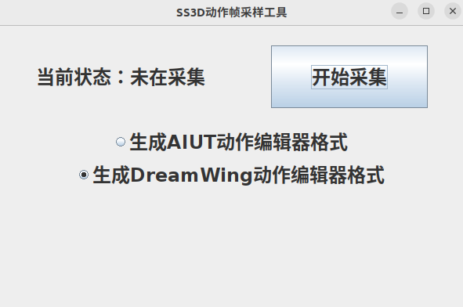

# DreamWing3D-Action-Sampler
> 这是一个由DreamWing3D设计的动作采样分析工具

## 温馨提示
1. 生成的动作文件中一般首行会有一个多出来的null，因为本人马上要成牛马了懒得改bug了，有兴趣的可以找找bug
2. 建议生成[DreamWing动作编辑器](https://github.com/TansirFlow/DreamWing-Motion-Editor)格式，因为AIUT动作编辑器比较古老，ubuntu18上跑老是闪退，用起来可能会有些挫折
3. 理论上即使你没有原代码也能采集到动作，因为该程序监听了TCP传输的过程获得信息，但是我们不建议你将他用在不开源的动作上，如果用于比赛可能会被判为违规
4. 建议将该工具仅用于动作设计的参考，因为这个原因造成的后果与本项目无关
5. 第3点和第4点
6. 第5点
7. 一般来说这个工具对神经网络构建的踢球动作没什么效果，毕竟神经网络每次的动作几乎都不一样

## 原理
在球员程序和server之间搭建一个中转，可以获得几乎所有信息，但这种提取方法存在误差，因为默认情况下球员观测到的数据存在噪声，你可以试试关闭球场噪声再采集动作试试